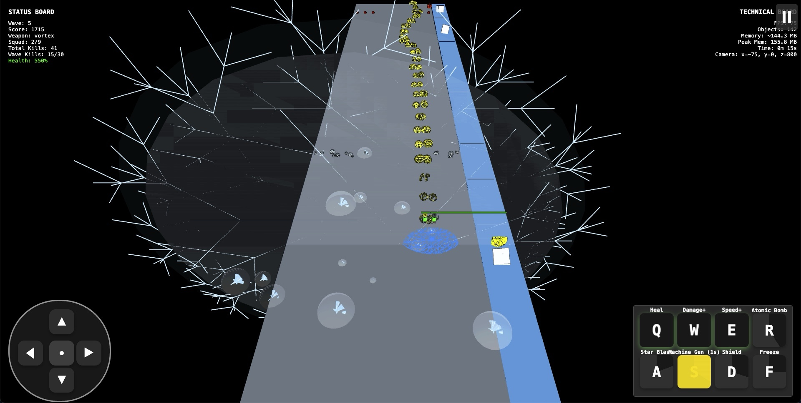
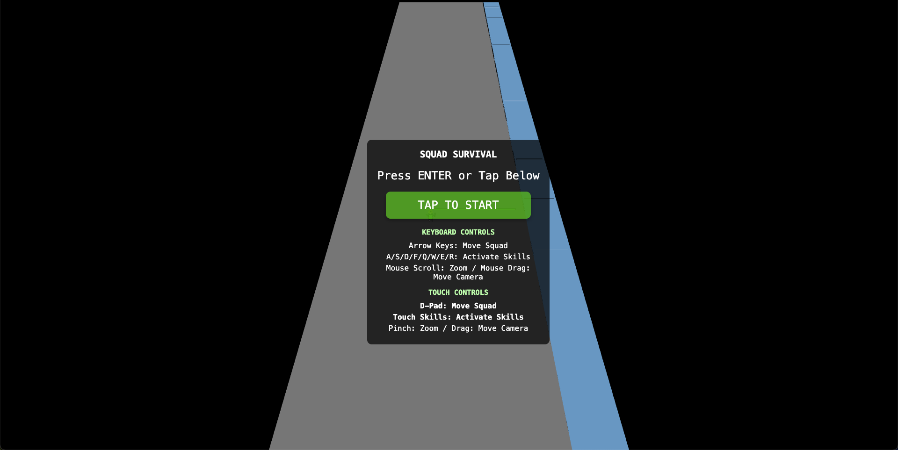
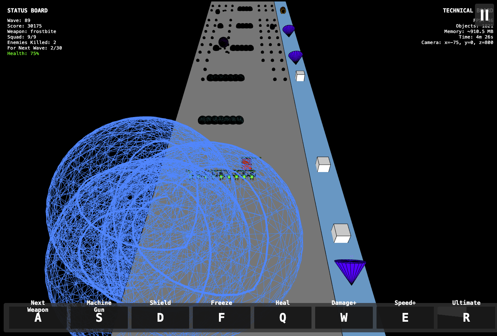
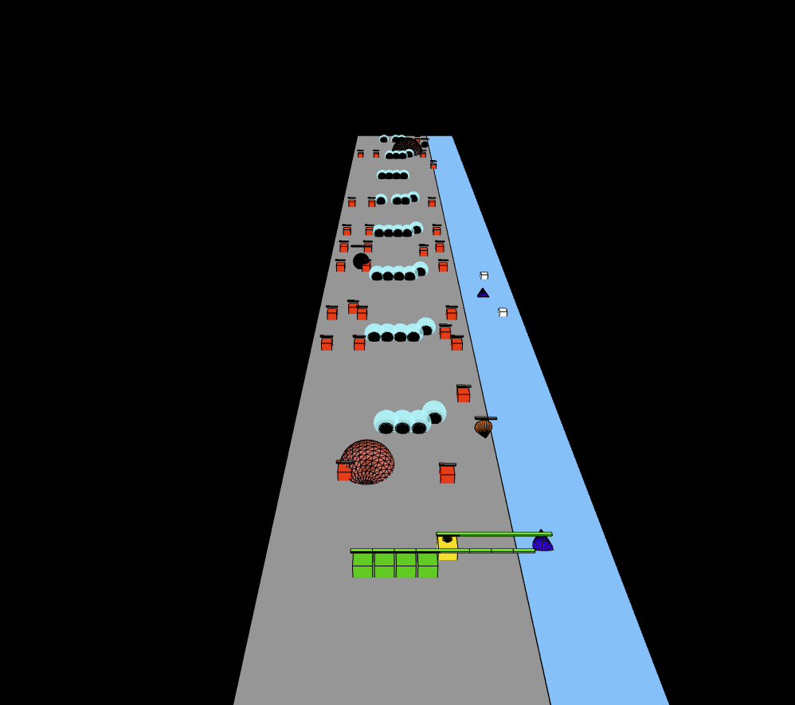

# Squad Survival

## Requirements

- **3D Design**: Follow the 3D layout from the provided image.
- **Gameplay Layout**: Implement a bridge from top to bottom with the squad at the bottom and enemies at the top.
- **Framework**: Use p5js for implementation.

## Key Features

- **Graphics**: Utilize simple p5js shapes for fast loading and smooth performance.
- **Visual Language**: Clear color coding for squad members, enemies, and power-ups.
- **Framework**: Built entirely on p5js with core methods in `squad.js`.

## Technical Implementation

- **Combat Mechanics**: Simulate complex combat and progression systems.
- **Performance**: Fast loading and smooth operation.
- **Controls**: Intuitive keyboard mapping for squad movement and skills.
- **Difficulty**: Progressive challenge through wave system and enemy scaling.

## Core Game Elements

### Squad System

- **Composition**: Start with one soldier.
- **Environment**: Bridge setting with auto-firing.
- **Power-ups**: Located on the right side.

### Weapon Arsenal

- **Types**: Various weapons with unique effects (e.g., `Mirror +1`, `Blaster 3000`).
- **Location**: Middle of the power-up lane, moving towards the squad.

### Enemy Types

- **Units**: Standard, Elite, and Boss hierarchy.

### Environment Layout

- **Lanes**: Main combat and power-up lanes.
- **Movement**: Squad can traverse both lanes; vertical movement is limited.

### Control Scheme

- **Hotkeys**: Skills mapped to keys (e.g., `A`, `S`, `D`).
- **Arrow Keys**: Squad movement.
- **Mouse**: Camera control and zoom.

## Game Systems

### Combat Mechanics

- **Squad Operations**: Dynamic size, tactical positioning, auto-combat.
- **Enemy AI**: Difficulty scaling, attack patterns, strategic positioning.

### Progression System

- **Power-ups**: Weapon upgrades and squad enhancements.
- **Skills**: Customizable loadouts and synergies.

## Game Architecture

### Wave System

- **Difficulty**: Progressive and dynamic scaling.
- **Save**: Auto-save with local storage.

### Progression Structure

- **Wave Tiers**: Early, Mid, and Late game scenarios.

## Health and Status

- **Health Bar**: Display enemy and skill damage.
- **Status Board**: Squad info, enemy count, wave, weapon type, and damage metrics.

## Technical Board

- **Info**: Camera viewpoint, time lapse, frame rate, memory usage.
