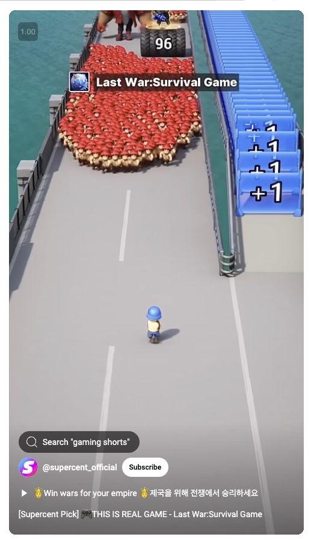

# Squad Survival

- MUST follow the 3d layout 3d design from image: 
- MUST be bridge from top to bottom, squad at bottom, enemies at top of the screen
- MUST implement using p5js

## Key Features
- **Lightweight Graphics**: Intentionally utilizing simple p5js shapes (boxes, spheres, cylinders) for all game elements, ensuring fast loading and smooth performance even on older devices.
- **Distinct Visual Language**: Using clear color coding to differentiate between squad members, various enemy types, and different power-ups for instant recognition.
- **p5js Framework**: The entire game is built on p5js, with the core squad.js file containing the standard setup() and draw() methods that p5js calls when loaded with index.html.

## Technical Implementation
- **Simple but Effective**: While visually straightforward, the game successfully simulates complex combat mechanics and progression systems.
- **Fast Loading**: Minimal assets mean the game initializes quickly and runs smoothly.
- **Responsive Controls**: Intuitive keyboard mapping allows for easy squad movement and skill activation.
- **Progressive Difficulty**: The wave system and enemy scaling provide increasing challenge as players advance.

## Core Game Elements

### Squad System
- Initial squad consists of **one soldier**
- Squad moves on a **bridge environment**
- Features **auto-firing** mechanism
- Enemies advance to attack the squad
- **Power-up lane** located on the right side

### Weapon Arsenal
1. `Mirror +1`: Spawns additional squad member on collection
2. `Blaster 3000`: High-speed green laser beam weapon
3. `Thunderbolt Cannon`: Heavy-impact projectiles with thunder effects
4. `Inferno Rifle`: Fire-based weapon with **DoT** (Damage over Time)
5. `Frostbite Sniper`: Ice projectiles with **CC** (Crowd Control)
6. `Vortex Blaster`: **AoE** (Area of Effect) crowd control weapon
7. `Plasma Shotgun`: Spread-fire **AoE** damage weapon
8. `Photon Pistol`: High-precision light-based weapon

Weapons, skills:
- Located in middle of power-up lane
- Auto move in straight direction on the power-up lane, toward close to the squad
- "Mirror +1" always appear on the line, appear a lot for the squad to pick up

### Enemy Types
- **Standard Units**: Regular infantry units
- **Elite Units**: Enhanced combat capabilities
- **Boss Hierarchy**: Boss 3 > Boss 2 > Boss 1

### Environment Layout
- **Main Combat Lane**: Primary battlefield
- **Power-up Lane**: Secondary path for upgrades
- **Movement Constraints**:
  - Squad can traverse both lanes
  - No safe zones in power-up lane
  - Vertical movement is limited

### Control Scheme
**Skill Hotkeys**:
- `A`: Skill 1
- `S`: Skill 2
- `D`: Skill 3
- `F`: Skill 4
- `Q`: Skill 5
- `W`: Skill 6
- `E`: Skill 7
- `R`: Skill 8

**Arrow Keys**
- Left: Move squad left
- Right: Move squad right
- Up: Move squad up
- Down: Move squad down

**Mouse's scroll button**
- Press + Drag to change the camera view, up, down, left, right
- Scroll to zoom in and out

## Game Systems

### Combat Mechanics
- **Squad Operations**:
  - Dynamic squad size through power-ups
  - Tactical positioning
  - Auto-combat system

- **Enemy AI**:
  - Progressive difficulty scaling
  - Dynamic attack patterns
  - Strategic positioning

### Progression System
- **Power-up System**:
  - Weapon upgrades
  - Squad enhancement
  - Tactical advantages

- **Skill System**:
  - Customizable loadouts
  - Strategic skill mapping
  - Combat synergies

## Game Architecture

### Wave System
- **Progressive Difficulty**
- **Dynamic Scaling**
- **Auto-save** functionality

### Combat Evolution
- **Scaling Power Curve**
- **Enhanced VFX**
- **Complex Enemy Patterns**

### Enhancement System
- **Persistent Upgrades**
- **Strategic Loadouts**
- **Cross-wave Progression**

### Save Functionality
- **Auto-save** system
- **Local Storage** implementation
- **Game State Management**:
  - Continue saved game
  - New game option

## Progression Structure

### Wave Tiers
1. **Early Game** (Waves 1-5)
   - Basic combat scenarios
   - Core weapon systems
   - Fundamental power-ups

2. **Mid Game** (Waves 6-15)
   - Advanced enemy types
   - Enhanced weapon systems
   - Elite power-ups
   - Mini-boss encounters

3. **Late Game** (Waves 16+)
   - Elite formations
   - Maximum visual impact
   - Multi-boss scenarios
   - Legendary power-ups

## Health bar

- Provide health bar to have sense of enemy, and skill damage

## Status board

- Inform: how many member in squad
- Inform: total enemy killed
- Inform: current wave
- Inform: weapon type
- Inform: how good the gun damage, how fast the gun is

## Technical board

- Inform: camera's x, y, z viewpoint
- Inform: time lapse
- Inform: frame rate
- Inform: memory usage
